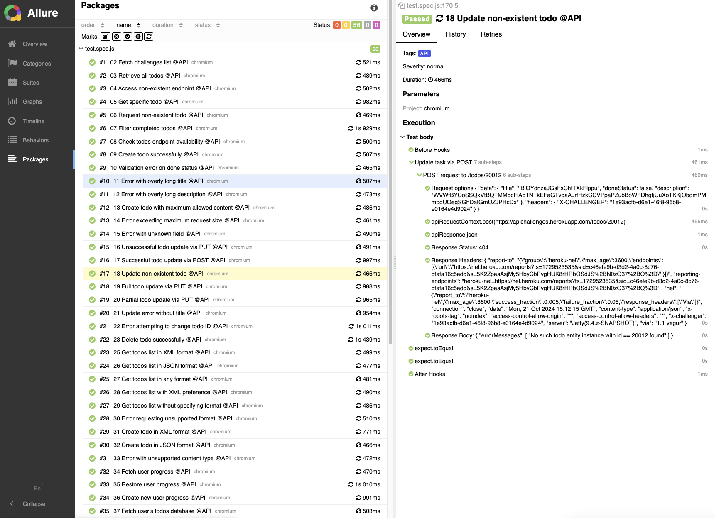

# API Challenges Test Suite

This project contains a suite of automated tests for the API endpoints of [https://apichallenges.herokuapp.com/](https://apichallenges.herokuapp.com/). The tests are written in JavaScript using the Playwright framework.

## Project Structure

- `tests/test.spec.js`: Contains the API tests for various endpoints.
- `README.md`: Project documentation.

## Installation

To get started with the project, follow the steps below:

1. Clone the repository: `git clone <repository-url>`
2. Navigate to the project directory: `cd <project-directory>`
3. Install the dependencies: `npm i`

## Running the Tests

To run the tests, use the following command:

```sh
npm run api
```

## Test Report

After running the tests, a test report will be generated in the `.allure-result` directory. To view the report, use the following command:

```sh
npm run allure
```

## Known Issues

Due to limitations in Playwright, it is not possible to execute tests numbered 24 and 43. This is because Playwright's `request` API does not currently support the `OPTIONS` and `TRACE` methods, which are required for these tests.

## Screenshots

Below is a placeholder for screenshots related to the test results:

1. **Allure Test Report Results**

   

2. **Test Results on API Challenges Page**

   
